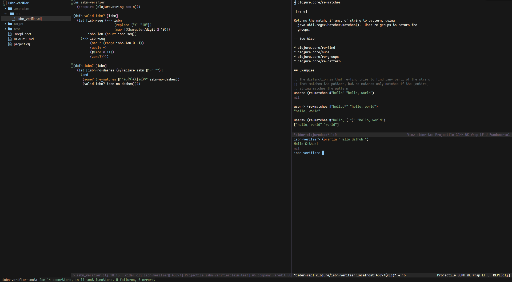

# Emacs Configuration

## Installation

#### The normal way
* Delete the `~/.emacs` file and the `~/.emacs.d` directory if they exist.
* Clone the repository inside the `~/.emacs.d/` directory.
  * i.e `git clone --depth 1 https://github.com/dimspith/dotemacs.git ~/.emacs.d/`

#### The way that doesn't bloat your $HOME
* Delete the `~/.emacs` file and the `~/.emacs.d` directory if they exist.
* Clone the repository inside the `~/.config/emacs/` directory.
  * i.e `git clone --depth 1 https://github.com/dimspith/dotemacs.git ~/.config/emacs/`

## How to run and configure

Upon starting emacs for the first time, all required packages will be automatically
downloaded inside the `~/.config/emacs/straight/repos` directory.

Settings and documentation are included inside the `config.org` file and any changes require emacs to be restarted.
The file can also be viewed through Github ([config.org](./config.org)) and contains some documentation.
